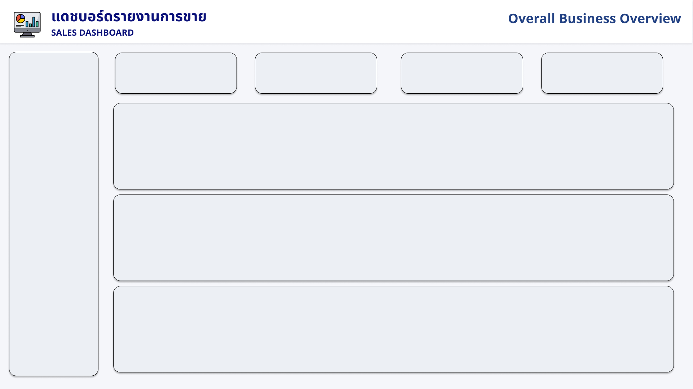
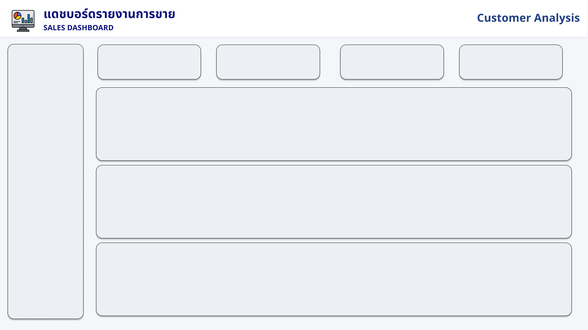

# 📊 Power BI Sales & Customer Analytics Dashboard

This repository contains my **Power BI portfolio project** built using the **Global Superstore dataset (~50,000 rows)**.  
The dashboard is designed to analyze **Sales Performance, Customer Behavior, and Product & Regional Performance** for business decision-making.

โปรเจกต์นี้เป็นส่วนหนึ่งของ Portfolio ด้าน Data Analyst  โดยใช้ Power BI เพื่อวิเคราะห์ข้อมูลยอดขาย ลูกค้า และสินค้าเชิงธุรกิจ

---

## 🧾 Dataset

- **Dataset Name:** Global Superstore
- **File:** `dataset/Global_Superstore2.csv`
- **Rows:** ~50,000
- **Period:** 2014 – 2017
- **Main Fields:**
  - Order ID, Order Date, Ship Date  
  - Customer Name, Segment  
  - Product Name, Category, Sub-Category  
  - Sales, Profit, Quantity, Discount  
  - Region, State, City  

---

## 🎯 Project Objectives | วัตถุประสงค์ของโปรเจกต์

- วิเคราะห์ **ยอดขาย (Sales) และกำไร (Profit)**
- วิเคราะห์พฤติกรรมลูกค้า **Customer Analysis**
- เปรียบเทียบประสิทธิภาพ **สินค้าและภูมิภาค**
- ใช้ข้อมูลช่วยสนับสนุนการตัดสินใจเชิงธุรกิจ

---

## 📌 Dashboard Pages

### 1️⃣ Sales Performance Dashboard
- Total Sales
- Total Profit
- Total Orders
- Sales Trend by Month
- Sales by Category

### 2️⃣ Customer Analysis Dashboard
- Total Customers
- Average Sales per Customer
- Average Profit per Customer
- Top 10 Customers by Sales
- Customer Segment Distribution

### 3️⃣ Product & Region Performance
- Top Products by Sales
- Sales by Region
- Product × Region Performance
- Profit by Sub-Category

---

## 🛠 Tools & Technologies

- Power BI Desktop
- DAX (Data Analysis Expressions)
- Data Modeling
- Microsoft Excel / CSV
- GitHub (Portfolio Hosting)

---

## 📐 Example DAX Measures

```DAX
Total Sales = SUM(Sales[Sales])

Total Profit = SUM(Sales[Profit])

Avg Orders per Customer = 
DIVIDE(
    DISTINCTCOUNT(Sales[Order ID]),
    DISTINCTCOUNT(Sales[Customer Name])
)




